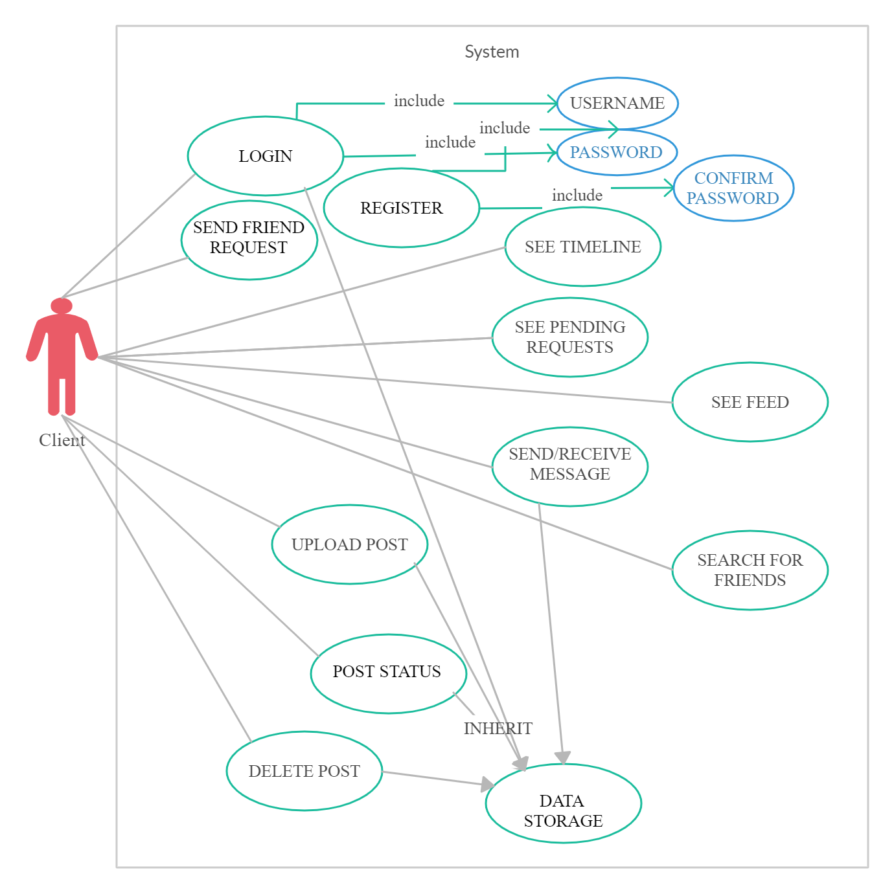

## MINI-FACE

CS 433: Computer Networks Project, under Prof. Sameer Kulkarni

Group Members: Dhruvin Patel (18110051), Harsh Patel(18110062), Viraj Shah(18110155)

---

## Table of contents

- [Introduction](#introduction)
- [Features](#features)
- [How To Use](#how-to-use)
- [Networking Paradigms](#networking-paradigms)
- [Mininet](#mininet)

---

## Introduction

Our task was to design and implement a simple internet tool that mimics the functionalities and features of Facebook. We have used Python programming language to implement this project using basic networking principles. 

---

## Features

Key features that we implemented in this project are-

1. Any client/user can register and set up an account, and is able to login to the created account.
2. The client is able to add/remove a friend.
3. The client can chat with online friends
4. The client is able to upload or delete posts (private and public).
5. The client is able to view timeline.
6. The client is able to view feed.
7. Can browse for new friends, view mutual friends of already existing friends.
8. Security aspects (masked password, server authentication)

---

## How To Use

First of all after starting the server, run the client file.

While using the mini-face, at each step, the server provides a list of options to choose from and those particular options can be selecting by simply typing the number associated with them. The server responds on the basis of the response obtained from the client.

So, at first, we will be provided with two options: Login or Register. We can type the appropriate number associated with the option that we want.

If we choose to register, the server will ask for a username and password, and if the username is already taken, we will have to choos another username, and it will also ask for password confirmation.
If we choose to login, the server will ask for username and password, and if the username does not exist, or the password is incorrect, it will show invalid, and we will have to try again.

As we login into the mini-face, we will be provided a list of options, each of which can be selected by typing the number indicated with the option.
	1: Friends
	2: Messages
	3: Pending Friend Requests{}
	4: Feed
	5: Upload post
	6: Delete post
	7: See your Timeline
	0: Exit Mini-Face

1. By selecting the 'Friends' option, we will again be provided with a list of choices as:

	1: See your Friends
	2: Find new Friends
	3: Remove Friends
	0: Go to Home Screen

Further selecting 'Friends' option, we can see our friends list, selecting option '2', we will further be provided with a list of choices shown below, for which we have to respond with the corresponding number to the task that we want.
	1: Search for Friends	--> Browse for username and the results matching with the string input will be listed with numbers associated with them, reply with the number associated with the username to send friend request to that user.
	2: See Friends of Friends	--> We can see the mutual friends of our friends and then choos to send them friend request in the same way as stated above.	
	0: Go to Friend Options		--> Go back to 'Friends' option

Similarly, if we select 'Remove Friends' option, the friens list will be shown (only 10 friends), and to view the next 10 friends, we willl have to type '11'. And, to remove the friend, type the number coresponding to that username.

2. By selecting the 'Messages' option, we will be provided a list of 10 friends along with their status (ONLINE/Away), and by typing '11', we will ge list of next 10 friends, and type the number coresponding to the username to initiate a chat session with him/her. We can send new messages, see previous messages or go back, by selecting the corrseponding option number.

3. By selecting the 'Pending Friend Requests' option, we will be shown the list of pending friend requests each with a number associated with it. Type the corresponding number to get an option of Accept (type 'y') /Delete (type 'n') that particular friend request, or we can type '0' to ignore all friend requests and go back.

4. By selecting the 'Feed' option, we can see the global posts of our friends with timestamp attached with each post, and these feed will show the latest posts first (4 posts at a time), and type '1' to view the previous 4 posts.

5. By selecting the 'Upload post' option, we can type the content of the post to be uploaded (maximum 125 characters). After that, we will be asked if we want the post to be private or global, and we can select that by typing the appropriate number. Also, a timestamp gets attached to it.

6. By selecting the 'Delete post' option, the timeline will be shown (4 posts at a time), type '1' to see next 4 posts. Now, select the post number to delete that post.

7. By selecting the 'See Your Timeline' option, the timeline will be shown (4 posts at a time), type '1' to see next 4 posts. Timestamp is also visible against each post and whether the post is private or global is also shown.

At any stage, typing '0' will bring back to the home-screen page of the mini-face.

Please note that replying with an empty string at any step while the mini-face is running, will result in an error. (So, do not send response as an empty string)

---

## Networking Paradigms

### Logical Flow

  

### Class Diagrams

  

### Use-Cases

  

---

## Mininet

We used the Mininet Topology to automate and create a large number of user base (Client nodes).  We use a Simple Tree topology with Depth=5 that allows us to have up to a total of 32 leaf hosts.

The implementation can cbe seen in the custom_topo.py in the root folder.
Server: server_mini.py
Client: client_mini.py

We use mininet_helper.py to build the input functions for the client hosts that caonnect to through the Mininet and set up a new account.
---
